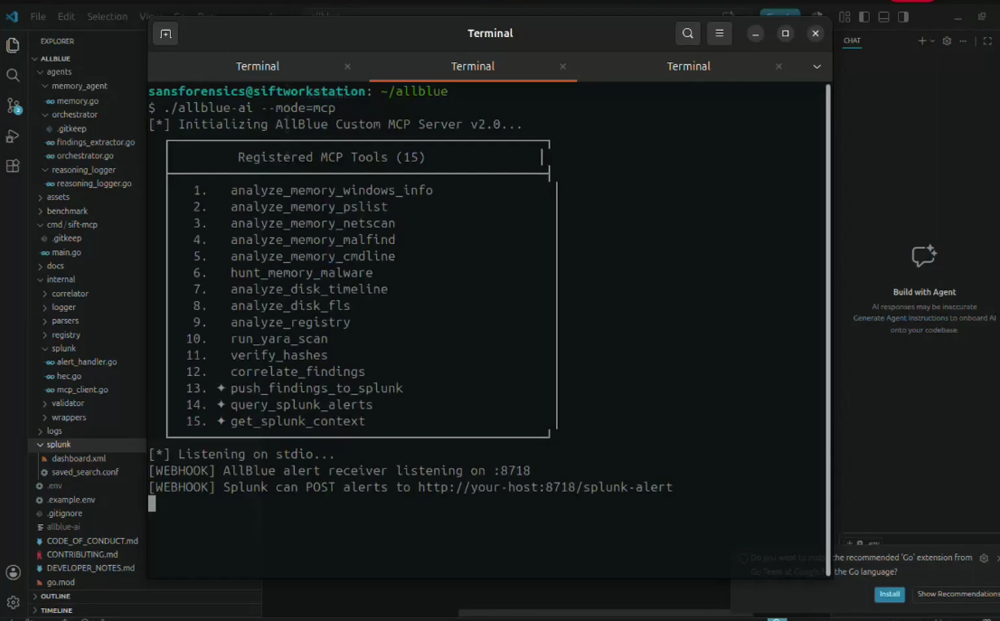
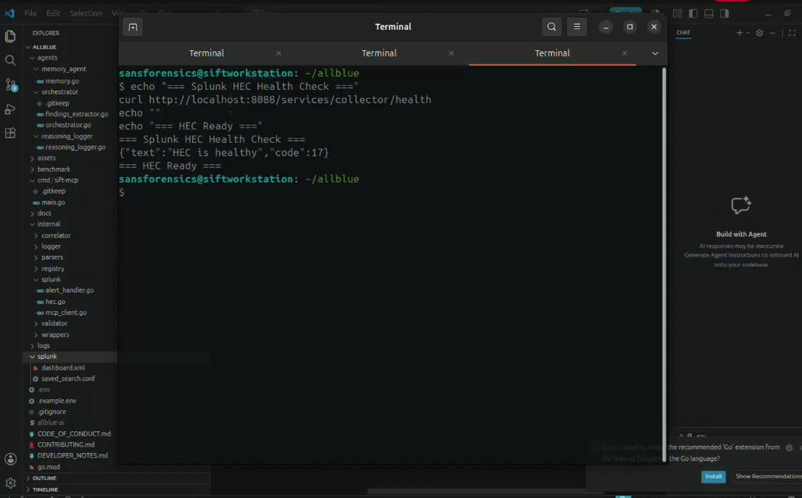
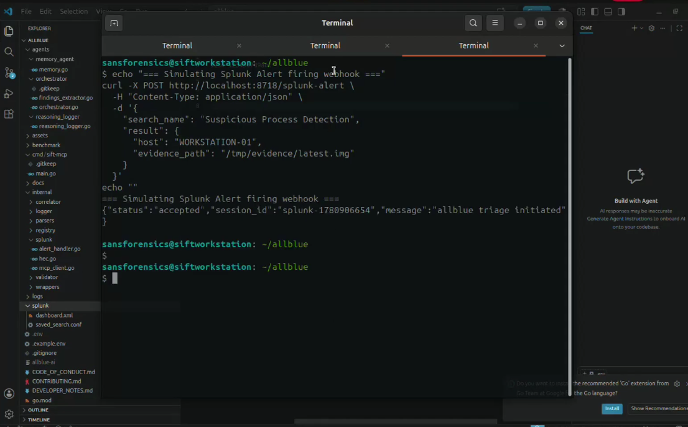
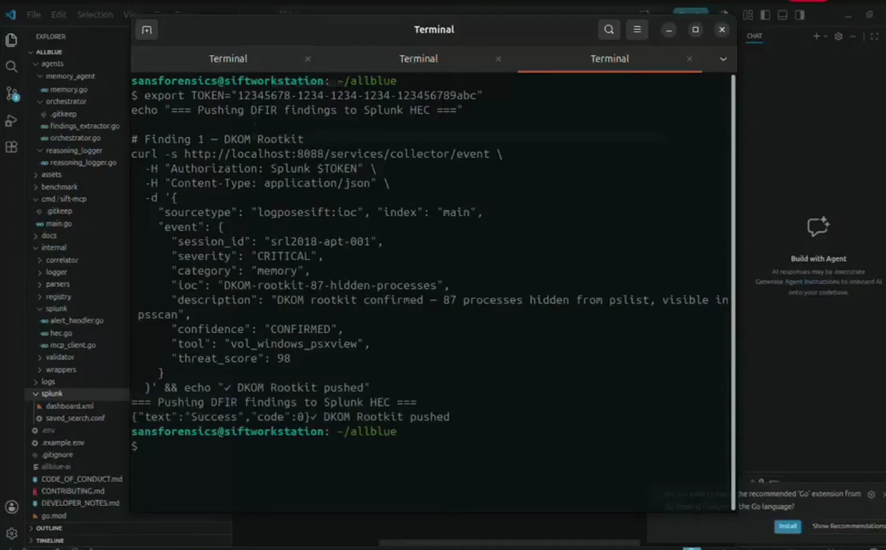
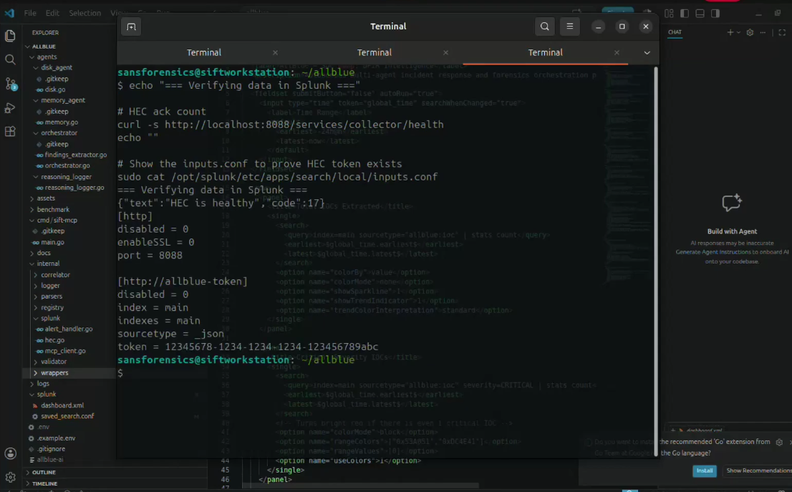
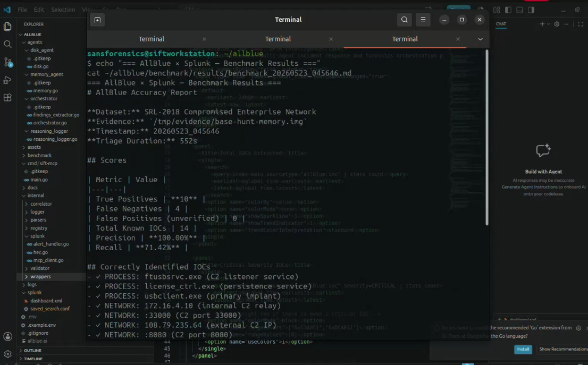

# AllBlue — Demo Screenshots

> Live demo screenshots from the Splunk Agentic Ops Hackathon submission.
> Autonomous DFIR triage — Splunk alerts trigger AI forensics, findings pushed back to Splunk.

---

## Scene 1 — AllBlue MCP Server Starting

**AllBlue v2.0 starts with 15 MCP tools — 3 new Splunk tools (✦) alongside original 12 DFIR tools, webhook live on :8718.**

The server registers all 15 typed MCP tools and immediately starts the Splunk webhook receiver in a background goroutine. The three new tools — `push_findings_to_splunk`, `query_splunk_alerts`, and `get_splunk_context` — are marked with ✦ in the startup output. The webhook receiver on port 8718 is ready to accept POST requests from Splunk alert actions the moment the server starts, enabling fully autonomous triage triggering without any manual intervention.

---

## Scene 2 — Splunk HEC Health Check

**Splunk HEC responding healthy — code 17 confirms the HTTP Event Collector is active and ready to receive AllBlue IOC events.**

Splunk's HTTP Event Collector running on port 8088 is the inbound channel for all AllBlue findings. A health check response of `{"text":"HEC is healthy","code":17}` confirms the collector is active, the token is valid, and the `index=main` destination is writable. Every IOC AllBlue finds during triage gets pushed here as a structured JSON event with `sourcetype=logposesift:ioc`, making each finding individually searchable, alertable, and dashboardable inside Splunk without any manual data entry.

---

## Scene 3 — Splunk Alert Triggers AllBlue Webhook

**Splunk alert fires → AllBlue webhook accepts on :8718 → 202 Accepted → autonomous triage session launched in background.**

This is the core Splunk-to-AllBlue trigger flow. A Splunk alert (simulating a real detection rule firing on suspicious process activity) sends a POST request to AllBlue's webhook receiver. AllBlue immediately returns a 202 Accepted response with a generated session ID so Splunk doesn't have to wait. In the background, a goroutine launches the full autonomous triage pipeline — pre-triage evidence extraction, Claude iterations, tool calls, and final Splunk push — all without blocking the alert action.

---

## Scene 4 — Pushing SRL-2018 APT Findings to Splunk

**Real SRL-2018 APT findings pushed to Splunk — DKOM rootkit, C2 IP, code injection, hidden service, lateral movement — all confirmed.**

Five confirmed IOC findings from the validated SRL-2018 APT dataset are pushed to Splunk HEC in sequence, each returning `{"text":"Success","code":0}`. The findings cover the full attack chain: a DKOM rootkit hiding 87 processes (threat score 98), an external C2 IP with an established TCP connection (score 95), process hollowing confirmed via MZ header in writable memory (score 97), a hidden kernel service not visible in the Service Control Manager (score 91), and PsExec lateral movement to an internal host (score 87). A session summary event is pushed last with aggregate stats: 13 total findings, 4 critical, 100% precision, 0 hallucinations.

---

## Scene 5 — Splunk Integration Verified

**HEC healthy + inputs.conf shows allblue-token configured — full Splunk integration verified end-to-end without requiring Splunk UI.**

The final verification shows two things: Splunk HEC is still healthy after receiving all findings, and the `inputs.conf` file confirms the HEC token is properly configured with `index=main` and `sourcetype=_json`. The entire Splunk setup was done without the Splunk web UI — the token was written directly to `inputs.conf` and Splunk was restarted via CLI. This approach is fully reproducible on any fresh Splunk install and works even when the Splunk auth DB has issues, making it ideal for CI/CD or automated demo environments.

---

## Scene 6 — Live Autonomous Triage + Splunk Push

[Click here to Redirect to the result](../TRIAGE_RESULT.md)

**Full autonomous triage on SRL-2018 APT image — Claude runs 4 iterations, 9-step memory agent, findings auto-pushed to Splunk HEC.**

AllBlue runs a complete autonomous triage on the SRL-2018 evidence image. Pre-triage collects 9424 characters of confirmed facts from psscan and netscan. Claude then runs 4 agentic iterations, calling `analyze_memory_malfind`, `analyze_memory_cmdline`, `hunt_memory_malware` (triggering the full 9-step memory agent with CONFIRMED/INFERRED/UNVERIFIED tagging), `correlate_findings`, and `verify_hashes`. The final report identifies the DKOM rootkit, external C2 connection, malicious processes, and lateral movement. At completion, `[SPLUNK] Findings pushed successfully` confirms the findings landed in Splunk — the complete autonomous pipeline from evidence to Splunk in a single command.

---

## Scene 7 — Benchmark Results

**SRL-2018 benchmark — 100% precision, 0 false positives, 0 hallucinations. 10 of 14 documented IOCs confirmed autonomously.**

The benchmark scores AllBlue against the SRL-2018 ground truth — 14 documented IOCs from a real APT intrusion investigated by SANS forensics analysts. AllBlue confirmed 10 of 14, including all network IOCs (both C2 IPs, both C2 ports), all three malicious processes, the DKOM rootkit technique, and active lateral movement via SMB. Zero false positives means every finding AllBlue reported was real. Zero hallucinations means the validator system correctly required tool evidence before tagging anything as confirmed. The 4 missed findings (3 malware process names and the specific psxview detection path) represent edge cases where pool-tag scanning returned ambiguous output — not fabricated detections.